# Plano de Projeto: App de Finanças Offline-First com Notificações (v4)

Este documento detalha a arquitetura e o plano de desenvolvimento para um aplicativo de finanças multiplataforma, incluindo autenticação de usuário, funcionalidade offline, captura de transações e **sistema de notificações in-app com WebSockets**.

## 1. Visão Geral e Diagramas

O app é totalmente funcional offline. A sincronização com a nuvem é um recurso opcional que requer que o usuário esteja autenticado. **As notificações funcionam apenas quando o usuário está online e autenticado.**

### Diagrama da Stack (Com Autenticação e Notificações)

```mermaid
flowchart TD
    subgraph App Cliente [App Cliente React Native]
        UI(Interface do Usuário) -- Interage --> B(Gerenciador de Estado - Zustand)
        B -- Atualiza/Lê --> DB{Banco de Dados Local WatermelonDB}
        UI -- Lê diretamente --> DB
        
        subgraph Auth [Serviço de Autenticação]
            direction LR
            OAUTH[Telas de Login - Google/Apple] --> JWT{Keychain}
        end

        subgraph Sync [🔄 Serviço de Sincronização]
             JWT -- Pega Token --> RUNNER[Executor]
        end

        subgraph Notifications [🔔 Sistema de Notificações]
            WS[WebSocket Client] --> NSTORE[NotificationStore - Zustand]
            NSTORE --> NUI[Componente de Notificações]
            JWT -- Autentica --> WS
        end

        DB -- Dados para Sincronizar --> Sync
        NSTORE -- Salva localmente --> DB
    end

    subgraph Backend [Backend Sua API]
        API{API REST} -- Recebe dados --> MONGO[DB - MongoDB]
        MONGO -- processado:false --> QUEUE[Orquestrador de Filas]
        QUEUE -- Processa --> MONGO
        
        subgraph NotificationSystem [🔔 Sistema de Notificações Backend]
            NAPI[Notification API] --> NMONGO[Notifications Collection]
            WSSERVER[WebSocket Server] -- Lê --> NMONGO
            SCHEDULER[Scheduler/Cron] -- Envia --> NAPI
            INSIGHTS[Insights Generator] -- Envia --> NAPI
        end
    end

    Auth -- Envia OAuth Token --> API
    API -- Retorna JWT --> Auth
    Sync -- Envia Transações com JWT --> API
    WS -- Conecta autenticado --> WSSERVER
    WSSERVER -- Envia notificações --> WS

    class UI ui
    class DB db
    class Sync sync
    class Auth auth
    class Notifications notification
```



### Diagrama de Fluxo: Sistema de Notificações

```mermaid
flowchart TD
    A[Usuário autentica no app] --> B[WebSocket conecta automaticamente]
    B --> C[Escuta notificações em tempo real]
    
    subgraph Backend [Backend - Envio de Notificações]
        D[Admin/Sistema cria notificação] --> E{Tipo de envio?}
        E -- Imediata --> F[Envia via WebSocket]
        E -- Programada --> G[Salva no MongoDB com scheduledFor]
        G --> H[Cron/Scheduler verifica]
        H --> I[Chegou a hora?]
        I -- Sim --> F
        I -- Não --> H
        F --> J[Marca como sent: true]
    end
    
    subgraph Cliente [Cliente - Recebimento]
        C --> K[Recebe notificação]
        K --> L[Salva no WatermelonDB local]
        L --> M[Exibe na UI]
        M --> N[Usuário visualiza]
        N --> O[Marca como read: true]
        O --> P[Envia confirmação via WebSocket]
    end
    
    P --> Q[Backend atualiza read: true]
```



## 2. Estrutura da Interface (UI/UX) - Atualizada

A navegação continua simples, com a adição do sistema de notificações.

- **Tela Principal (Dashboard)**: 
  - Adicionar um ícone de sino no header com badge mostrando notificações não lidas
  - Banner sutil para notificações importantes do sistema

- **Tela Secundária (Ações e Configurações)**:
  - Seção "Notificações" com lista das notificações recentes
  - Toggle para ativar/desativar tipos de notificação
  - Para usuários anônimos: área de login permanece
  - Para usuários autenticados: perfil + configurações de notificação

- **Modal/Drawer de Notificações**:
  - Lista completa de notificações
  - Filtros por tipo (sistema, insights, lembretes)
  - Ações: marcar como lida, limpar todas

## 3. Modelos de Dados (WatermelonDB) - Atualizados

### Modelo de Notificação (Novo)

```typescript
// models/Notification.ts
import { Model } from '@nozbe/watermelondb'
import { field, date, readonly } from '@nozbe/watermelondb/decorators'

export type NotificationType = 'system' | 'insights' | 'sync_reminder'

export default class Notification extends Model {
  static table = 'notifications'

  @field('notification_id') notificationId!: string // ID do backend
  @field('user_id') userId!: string
  @field('type') type!: NotificationType
  @field('title') title!: string
  @field('message') message!: string
  @field('data') data?: string // JSON string para dados extras
  @field('read') read!: boolean
  @field('priority') priority!: number // 1=baixa, 2=normal, 3=alta
  @date('scheduled_for') scheduledFor?: Date
  @readonly @date('created_at') createdAt!: Date
  @readonly @date('updated_at') updatedAt!: Date
}
```

### Schema Atualizado

```typescript
// schema/index.ts
import { appSchema, tableSchema } from '@nozbe/watermelondb'

export default appSchema({
  version: 2, // Incrementado para incluir notificações
  tables: [
    // ... tabelas existentes (Transaction, Category, etc.)
    
    tableSchema({
      name: 'notifications',
      columns: [
        { name: 'notification_id', type: 'string', isIndexed: true },
        { name: 'user_id', type: 'string', isIndexed: true },
        { name: 'type', type: 'string', isIndexed: true },
        { name: 'title', type: 'string' },
        { name: 'message', type: 'string' },
        { name: 'data', type: 'string', isOptional: true },
        { name: 'read', type: 'boolean', isIndexed: true },
        { name: 'priority', type: 'number' },
        { name: 'scheduled_for', type: 'number', isOptional: true },
        { name: 'created_at', type: 'number' },
        { name: 'updated_at', type: 'number' },
      ]
    })
  ]
})
```

## 4. Estrutura dos Serviços (Client-Side)

### 4.1 WebSocket Service

```typescript
// services/WebSocketService.ts
import { io, Socket } from 'socket.io-client'
import { useAuthStore } from '../stores/authStore'
import { useNotificationStore } from '../stores/notificationStore'

class WebSocketService {
  private socket: Socket | null = null
  private reconnectAttempts = 0
  private maxReconnectAttempts = 5

  connect() {
    const { jwt, isAuthenticated } = useAuthStore.getState()
    
    if (!isAuthenticated || !jwt) {
      console.log('User not authenticated, skipping WebSocket connection')
      return
    }

    this.socket = io('ws://seu-backend.com', {
      auth: { token: jwt },
      transports: ['websocket']
    })

    this.setupListeners()
  }

  private setupListeners() {
    if (!this.socket) return

    this.socket.on('connect', () => {
      console.log('WebSocket connected')
      this.reconnectAttempts = 0
    })

    this.socket.on('notification', (notification) => {
      useNotificationStore.getState().addNotification(notification)
    })

    this.socket.on('disconnect', () => {
      console.log('WebSocket disconnected')
      this.handleReconnect()
    })

    this.socket.on('connect_error', (error) => {
      console.error('WebSocket connection error:', error)
      this.handleReconnect()
    })
  }

  markAsRead(notificationId: string) {
    if (this.socket?.connected) {
      this.socket.emit('mark_read', { notificationId })
    }
  }

  disconnect() {
    if (this.socket) {
      this.socket.disconnect()
      this.socket = null
    }
  }

  private handleReconnect() {
    if (this.reconnectAttempts < this.maxReconnectAttempts) {
      setTimeout(() => {
        this.reconnectAttempts++
        this.connect()
      }, Math.pow(2, this.reconnectAttempts) * 1000) // Exponential backoff
    }
  }
}

export default new WebSocketService()
```

### 4.2 Notification Store (Zustand)

```typescript
// stores/notificationStore.ts
import { create } from 'zustand'
import { database } from '../database'
import Notification, { NotificationType } from '../models/Notification'
import WebSocketService from '../services/WebSocketService'

interface NotificationState {
  notifications: Notification[]
  unreadCount: number
  isLoading: boolean
  
  // Actions
  loadNotifications: () => Promise<void>
  addNotification: (notification: any) => Promise<void>
  markAsRead: (notificationId: string) => Promise<void>
  markAllAsRead: () => Promise<void>
  clearNotifications: () => Promise<void>
  getNotificationsByType: (type: NotificationType) => Notification[]
}

export const useNotificationStore = create<NotificationState>((set, get) => ({
  notifications: [],
  unreadCount: 0,
  isLoading: false,

  loadNotifications: async () => {
    set({ isLoading: true })
    try {
      const notifications = await database.get<Notification>('notifications')
        .query()
        .sortBy('created_at', 'desc')
        .fetch()
      
      const unreadCount = notifications.filter(n => !n.read).length
      
      set({ 
        notifications, 
        unreadCount,
        isLoading: false 
      })
    } catch (error) {
      console.error('Error loading notifications:', error)
      set({ isLoading: false })
    }
  },

  addNotification: async (notificationData: any) => {
    try {
      await database.write(async () => {
        const notification = await database.get<Notification>('notifications').create(n => {
          n.notificationId = notificationData.id
          n.userId = notificationData.userId
          n.type = notificationData.type
          n.title = notificationData.title
          n.message = notificationData.message
          n.data = notificationData.data ? JSON.stringify(notificationData.data) : undefined
          n.read = false
          n.priority = notificationData.priority || 2
          n.scheduledFor = notificationData.scheduledFor ? new Date(notificationData.scheduledFor) : undefined
        })
        
        return notification
      })
      
      // Reload notifications to update state
      get().loadNotifications()
    } catch (error) {
      console.error('Error adding notification:', error)
    }
  },

  markAsRead: async (notificationId: string) => {
    try {
      const notification = await database.get<Notification>('notifications')
        .find(notificationId)
      
      await database.write(async () => {
        await notification.update(n => {
          n.read = true
        })
      })
      
      // Notify backend via WebSocket
      WebSocketService.markAsRead(notificationId)
      
      // Update local state
      get().loadNotifications()
    } catch (error) {
      console.error('Error marking notification as read:', error)
    }
  },

  markAllAsRead: async () => {
    try {
      const unreadNotifications = get().notifications.filter(n => !n.read)
      
      await database.write(async () => {
        const promises = unreadNotifications.map(notification =>
          notification.update(n => {
            n.read = true
          })
        )
        await Promise.all(promises)
      })
      
      // Notify backend for each notification
      unreadNotifications.forEach(n => {
        WebSocketService.markAsRead(n.notificationId)
      })
      
      get().loadNotifications()
    } catch (error) {
      console.error('Error marking all notifications as read:', error)
    }
  },

  clearNotifications: async () => {
    try {
      await database.write(async () => {
        const allNotifications = await database.get<Notification>('notifications').query().fetch()
        const promises = allNotifications.map(n => n.markAsDeleted())
        await Promise.all(promises)
      })
      
      set({ notifications: [], unreadCount: 0 })
    } catch (error) {
      console.error('Error clearing notifications:', error)
    }
  },

  getNotificationsByType: (type: NotificationType) => {
    return get().notifications.filter(n => n.type === type)
  }
}))
```

## 5. Componentes da Interface

### 5.1 Notification Bell Component

```typescript
// components/NotificationBell.tsx
import React from 'react'
import { TouchableOpacity, View, Text } from 'react-native'
import { Bell } from 'lucide-react-native'
import { useNotificationStore } from '../stores/notificationStore'

interface NotificationBellProps {
  onPress: () => void
}

export const NotificationBell: React.FC<NotificationBellProps> = ({ onPress }) => {
  const { unreadCount } = useNotificationStore()

  return (
    <TouchableOpacity onPress={onPress} className="relative">
      <Bell size={24} color="#333" />
      {unreadCount > 0 && (
        <View className="absolute -top-2 -right-2 bg-red-500 rounded-full min-w-5 h-5 flex items-center justify-center">
          <Text className="text-white text-xs font-bold">
            {unreadCount > 99 ? '99+' : unreadCount}
          </Text>
        </View>
      )}
    </TouchableOpacity>
  )
}
```

### 5.2 Notification List Component

```typescript
// components/NotificationList.tsx
import React, { useEffect } from 'react'
import { FlatList, View, Text, TouchableOpacity } from 'react-native'
import { useNotificationStore } from '../stores/notificationStore'
import { formatDistanceToNow } from 'date-fns'
import { ptBR } from 'date-fns/locale'

const NotificationItem: React.FC<{ notification: any }> = ({ notification }) => {
  const { markAsRead } = useNotificationStore()

  const handlePress = () => {
    if (!notification.read) {
      markAsRead(notification.id)
    }
  }

  const getTypeColor = (type: string) => {
    switch (type) {
      case 'system': return 'bg-blue-100'
      case 'insights': return 'bg-green-100'
      case 'sync_reminder': return 'bg-yellow-100'
      default: return 'bg-gray-100'
    }
  }

  return (
    <TouchableOpacity
      onPress={handlePress}
      className={`p-4 border-b border-gray-200 ${!notification.read ? 'bg-blue-50' : 'bg-white'}`}
    >
      <View className="flex-row justify-between items-start">
        <View className="flex-1">
          <Text className={`font-semibold ${!notification.read ? 'text-gray-900' : 'text-gray-600'}`}>
            {notification.title}
          </Text>
          <Text className={`mt-1 ${!notification.read ? 'text-gray-700' : 'text-gray-500'}`}>
            {notification.message}
          </Text>
          <View className="flex-row items-center mt-2">
            <View className={`px-2 py-1 rounded-full ${getTypeColor(notification.type)}`}>
              <Text className="text-xs font-medium capitalize">
                {notification.type.replace('_', ' ')}
              </Text>
            </View>
          </View>
        </View>
        <Text className="text-xs text-gray-400 ml-2">
          {formatDistanceToNow(notification.createdAt, { 
            addSuffix: true,
            locale: ptBR 
          })}
        </Text>
      </View>
    </TouchableOpacity>
  )
}

export const NotificationList: React.FC = () => {
  const { notifications, isLoading, loadNotifications, markAllAsRead } = useNotificationStore()

  useEffect(() => {
    loadNotifications()
  }, [])

  if (isLoading) {
    return (
      <View className="flex-1 justify-center items-center">
        <Text>Carregando notificações...</Text>
      </View>
    )
  }

  return (
    <View className="flex-1">
      <View className="flex-row justify-between items-center p-4 border-b border-gray-200">
        <Text className="text-lg font-semibold">Notificações</Text>
        {notifications.some(n => !n.read) && (
          <TouchableOpacity onPress={markAllAsRead}>
            <Text className="text-blue-600 font-medium">Marcar todas como lidas</Text>
          </TouchableOpacity>
        )}
      </View>
      
      <FlatList
        data={notifications}
        keyExtractor={(item) => item.id}
        renderItem={({ item }) => <NotificationItem notification={item} />}
        ListEmptyComponent={
          <View className="flex-1 justify-center items-center p-8">
            <Text className="text-gray-500">Nenhuma notificação ainda</Text>
          </View>
        }
      />
    </View>
  )
}
```

## 6. Integração com Auth Service

### Atualização do Auth Store

```typescript
// stores/authStore.ts - Adicionar ao store existente
import WebSocketService from '../services/WebSocketService'

// Adicionar nas actions:
login: async (token: string) => {
  // ... lógica existente de login
  
  // Conectar WebSocket após login
  WebSocketService.connect()
},

logout: async () => {
  // Desconectar WebSocket antes de logout
  WebSocketService.disconnect()
  
  // ... lógica existente de logout
}
```

## 7. Estrutura Backend (Para Implementação Futura)

### 7.1 Modelo de Notificação (MongoDB)

```javascript
// models/Notification.js
const notificationSchema = {
  _id: ObjectId,
  userId: ObjectId, // ref: 'User'
  type: String, // 'system', 'insights', 'sync_reminder'
  title: String,
  message: String,
  data: Object, // dados extras específicos do tipo
  priority: Number, // 1=baixa, 2=normal, 3=alta
  sent: Boolean, // se foi enviado via WebSocket
  read: Boolean, // se foi lido pelo usuário
  scheduledFor: Date, // para notificações programadas
  createdAt: Date,
  updatedAt: Date
}
```

### 7.2 API Endpoints (Referência)

```javascript
// POST /api/notifications - Criar notificação
// GET /api/notifications - Listar notificações do usuário
// PATCH /api/notifications/:id/read - Marcar como lida
// DELETE /api/notifications/:id - Deletar notificação

// WebSocket Events:
// 'notification' - Enviar notificação para o cliente
// 'mark_read' - Cliente confirma leitura
```

## 8. Plano de Desenvolvimento Atualizado (Fases)

### Fase 1: Fundação e Core Offline (1 semana)
- [ ] Iniciar projeto com a navegação de duas telas
- [ ] Configurar WatermelonDB e criar os modelos (incluindo Notification)
- [ ] Construir o formulário de cadastro e a lista de transações 100% funcionais offline

### Fase 2: Autenticação e Gestão de Sessão (1.5 semana)
- [ ] Integrar react-native-keychain
- [ ] Integrar a biblioteca de OAuth escolhida (comece com uma, ex: Google)
- [ ] Criar as telas e a lógica de UI para login/logout
- [ ] Implementar o fluxo de troca de token OAuth por JWT com o seu backend
- [ ] Criar um hook de estado global (ex: useAuth) que informa ao app se o usuário está logado ou não

### Fase 3: Sistema de Notificações Client-Side (1.5 semana) - **NOVO**
- [ ] Configurar socket.io-client
- [ ] Implementar WebSocketService com reconexão automática
- [ ] Criar NotificationStore com Zustand
- [ ] Desenvolver componentes de UI (Bell, List, Item)
- [ ] Integrar notificações com o sistema de autenticação
- [ ] Testar fluxos offline/online

### Fase 4: A Mágica da Captura e Tagging (2 semanas)
- [ ] Integrar react-native-notification-listener
- [ ] Desenvolver o parser de Regex e a lógica de sugestão de tags
- [ ] Criar a UI de confirmação da transação

### Fase 5: Conexão e Sincronia Autenticada (1 semana)
- [ ] Criar o SyncService.ts
- [ ] Fazer o serviço verificar o useAuth ou a Keychain antes de rodar
- [ ] Implementar o envio de dados com o JWT no cabeçalho
- [ ] Implementar o polling de status
- [ ] Configurar react-native-background-fetch

### Fase 6: Dashboard e Polimento (Em paralelo)
- [ ] Construir os gráficos e resumos da tela principal
- [ ] Refinar a UX, animações e testar exaustivamente todos os fluxos
- [ ] Integrar notificações no dashboard (badges, banners)

### Fase 7: Backend de Notificações (Implementação futura) - **NOVO**
- [ ] Implementar WebSocket server
- [ ] Criar API de gerenciamento de notificações
- [ ] Implementar sistema de scheduler para notificações programadas
- [ ] Desenvolver gerador de insights automáticos
- [ ] Criar painel admin para envio de notificações do sistema

## 9. Dependências Adicionais

```json
{
  "socket.io-client": "^4.7.2",
  "date-fns": "^2.30.0"
}
```

## 10. Considerações Técnicas

### Performance:
- WebSocket com reconexão inteligente (exponential backoff)
- Armazenamento local para funcionar offline
- Lazy loading da lista de notificações

### UX:
- Estados de loading bem definidos
- Feedback visual para ações do usuário
- Graceful degradation quando offline

### Escalabilidade:
- Estrutura preparada para múltiplos tipos de notificação
- Fácil extensão para push notifications no futuro
- Backend com sistema de filas já preparado

### Segurança:
- Autenticação via JWT no WebSocket
- Validação de permissões no backend
- Sanitização de dados das notificações