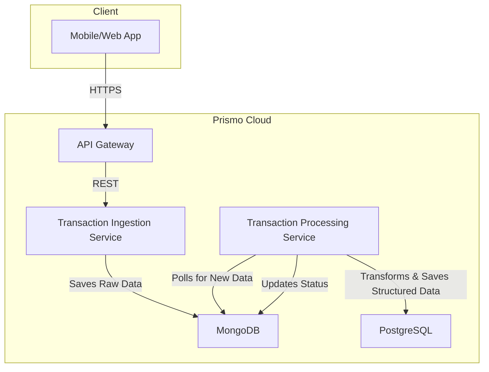
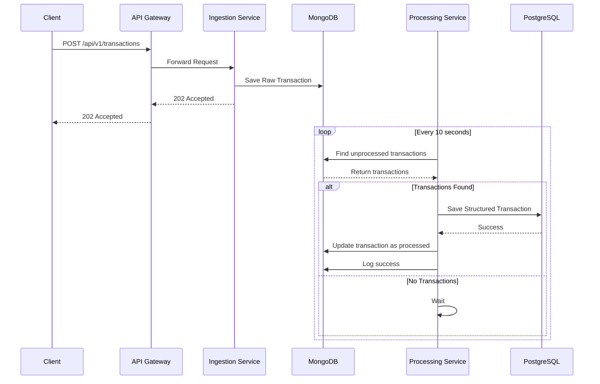

# Prismo Cloud

Prismo Cloud is a robust, scalable, and secure financial data processing platform designed to handle a high volume of transactions. It provides a comprehensive solution for receiving, processing, and storing financial data from various sources, ensuring data integrity, security, and availability.

## Features

- [x] **Asynchronous Processing:** Transactions are received and queued for asynchronous processing.
- [x] **Dual Database Architecture:** Utilizes MongoDB for raw data and PostgreSQL for structured data.
- [x] **Scalable Architecture:** Built with a microservices-friendly architecture.
- [x] **Dockerized Environment:** Fully containerized with Docker and Docker Compose.
- [x] **Comprehensive Testing:** Includes a full suite of unit, integration, and end-to-end tests.
- [x] **Detailed Logging:** Provides detailed logging for all operations.

## Architecture



## Data Flow



## Tech Stack

- **Backend:** Node.js, Express, TypeScript
- **Databases:** MongoDB, PostgreSQL
- **ORM:** Prisma (for PostgreSQL), Mongoose (for MongoDB)
- **Testing:** Jest, Supertest
- **Containerization:** Docker, Docker Compose

## Getting Started

### Prerequisites

- [ ] Node.js (v18 or higher)
- [ ] Docker
- [ ] Docker Compose

### Installation

1.  Clone the repository:
    ```bash
    git clone https://github.com/rimesestevao/prismo-cloud.git
    ```
2.  Install the dependencies:
    ```bash
    npm install
    ```
3.  Create a `.env` file based on the `.env.example` file and provide the necessary environment variables.
4.  Start the database containers:
    ```bash
    docker-compose up -d
    ```
5.  Run the database migrations:
    ```bash
    npx prisma migrate dev
    ```
6.  Start the application:
    ```bash
    npm run dev
    ```

The application will be available at `http://localhost:3000`.

## To-Do

- [ ] **Worker Throttling:** Implement limitations on the transaction processor.
- [ ] **Dead-Letter Queue:** Implement a dead-letter queue for failed transactions.
- [ ] **Authentication & Authorization:** Enhance API security (e.g., JWT, OAuth2).
- [ ] **Data Validation:** Implement comprehensive data validation (e.g., Zod).
- [ ] **Monitoring & Alerting:** Integrate a monitoring solution (e.g., Prometheus, Grafana).

## Performance Suggestions

- **Connection Pooling:** Ensure proper management of database connections.
- **Indexing:** Add indexes to database tables to speed up queries.
- **Caching:** Implement a caching layer (e.g., Redis).
- **Load Balancing:** Use a load balancer in production.

## Security Suggestions

- **Environment Variables:** Use environment variables for sensitive data.
- **Input Validation:** Validate and sanitize all user input.
- **Rate Limiting:** Implement rate limiting to prevent abuse.
- **Dependency Scanning:** Regularly scan for vulnerabilities.
